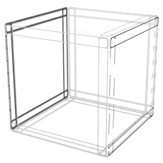

# cube



cube is a toy language I'm mucking about with. It might work, it might not.

## Hello World

```
package main

require <fmt>

var OK = 0

// The entrypoint of an application is main.main
// This entryopint is expected to return an exit status (a status is a type derievd from
// an int64).
f main() -> (status) {
    fmt.Println("Hello, World!")

    return OK
}
```

## Test Compilation

This repo contains the script [bin/cubec](bin/cubec) which does the necessary compile/ link steps to build a binary:


```bash
$ ${CUBE_SRC}/bin/cubec
```

This will build a binary from cube sources in the working directory. To see an IR of what the compiler is building, set `CUBE_DEBUG-=1`.

## Spec

The cube language spec can be found as an EBNF grammar in [spec/grammar.ebnf](spec/grammar.ebnf), or as a bison parser input at [src/parser.y](src/parser.y). The grammar defined in both files should be identical.

## Effective Errors

Compiler errors are prefixed with an exception ID which should aid in debugging. They also show the precise line an error is in:

```
cube: compilation failed with exception C002
        identifier 'exit_ok' does not exist
        at ./main.cb line: 6, col: 1
```

In this case, exception C002. The meaning of these exceptions can be found in [src/exceptions.h](src/exceptions.h).

## Licence

Copyright 2020 James Condron

Redistribution and use in source and binary forms, with or without modification, are permitted provided that the following conditions are met:

1. Redistributions of source code must retain the above copyright notice, this list of conditions and the following disclaimer.

2. Redistributions in binary form must reproduce the above copyright notice, this list of conditions and the following disclaimer in the documentation and/or other materials provided with the distribution.

3. Neither the name of the copyright holder nor the names of its contributors may be used to endorse or promote products derived from this software without specific prior written permission.

THIS SOFTWARE IS PROVIDED BY THE COPYRIGHT HOLDERS AND CONTRIBUTORS "AS IS" AND ANY EXPRESS OR IMPLIED WARRANTIES, INCLUDING, BUT NOT LIMITED TO, THE IMPLIED WARRANTIES OF MERCHANTABILITY AND FITNESS FOR A PARTICULAR PURPOSE ARE DISCLAIMED. IN NO EVENT SHALL THE COPYRIGHT HOLDER OR CONTRIBUTORS BE LIABLE FOR ANY DIRECT, INDIRECT, INCIDENTAL, SPECIAL, EXEMPLARY, OR CONSEQUENTIAL DAMAGES (INCLUDING, BUT NOT LIMITED TO, PROCUREMENT OF SUBSTITUTE GOODS OR SERVICES; LOSS OF USE, DATA, OR PROFITS; OR BUSINESS INTERRUPTION) HOWEVER CAUSED AND ON ANY THEORY OF LIABILITY, WHETHER IN CONTRACT, STRICT LIABILITY, OR TORT (INCLUDING NEGLIGENCE OR OTHERWISE) ARISING IN ANY WAY OUT OF THE USE OF THIS SOFTWARE, EVEN IF ADVISED OF THE POSSIBILITY OF SUCH DAMAGE.
